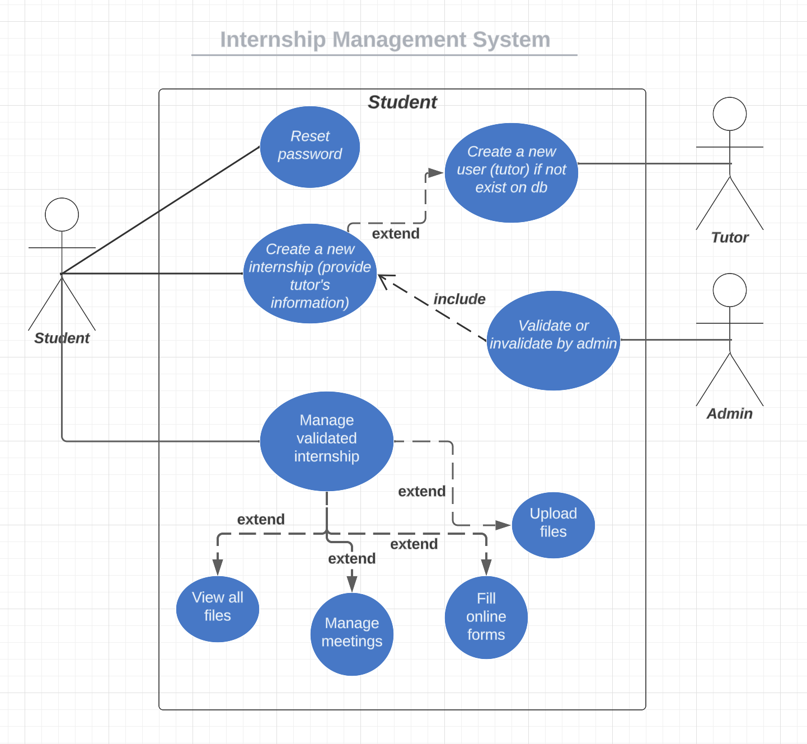
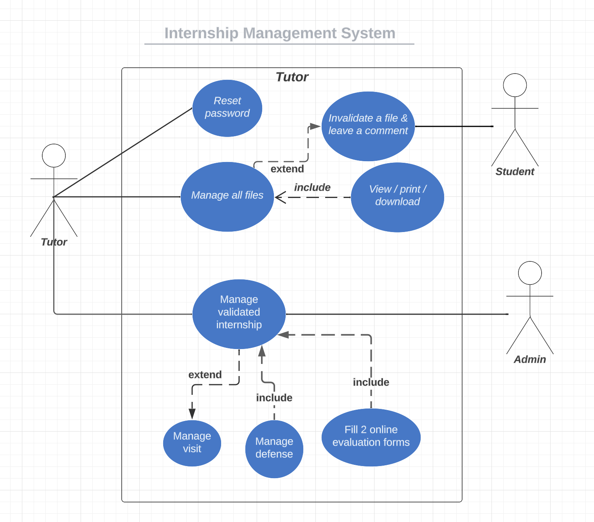
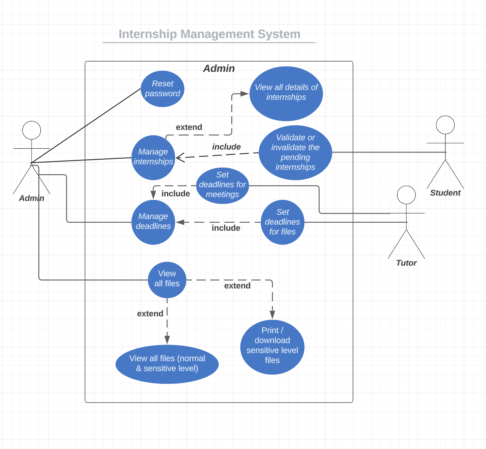
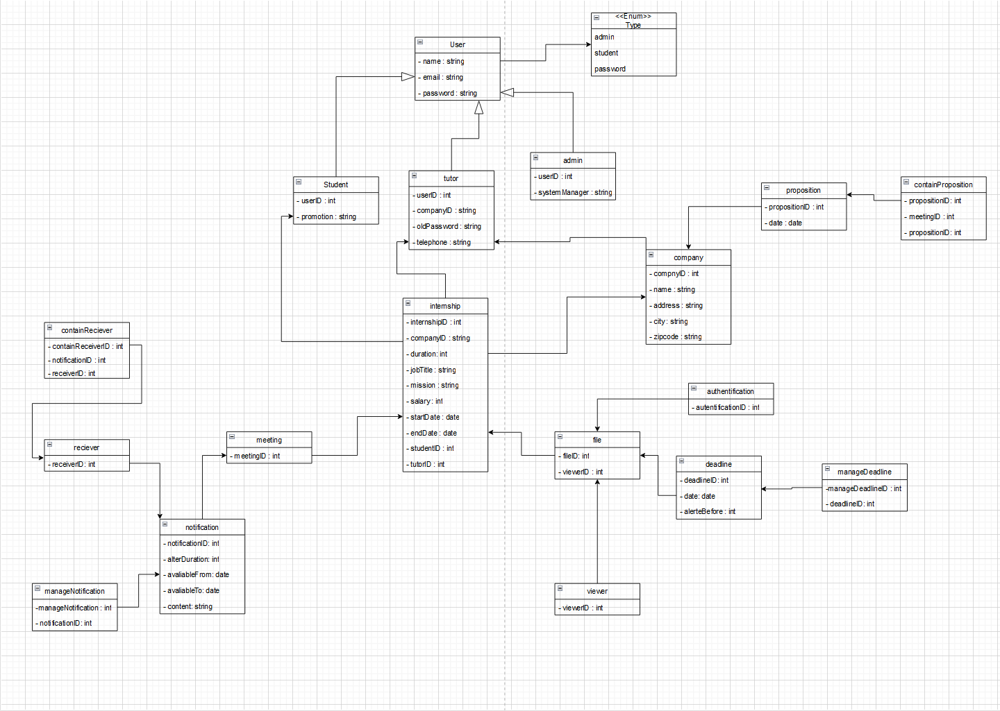
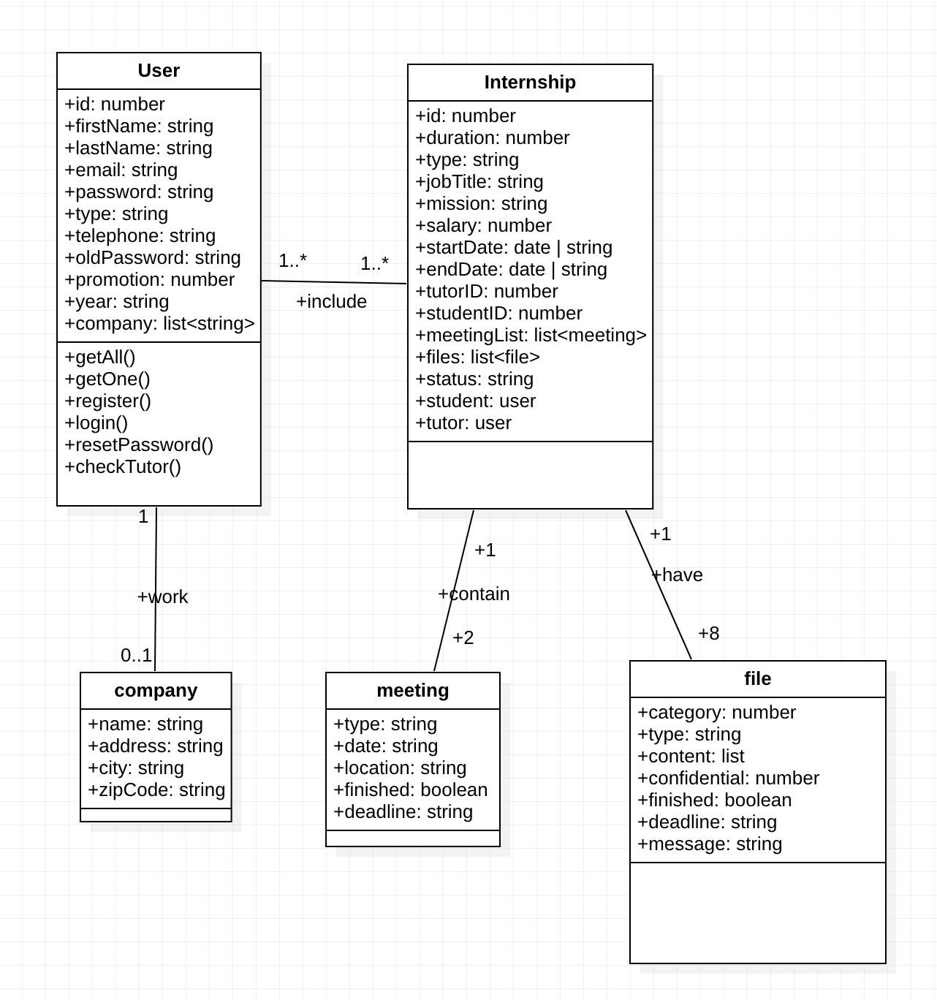
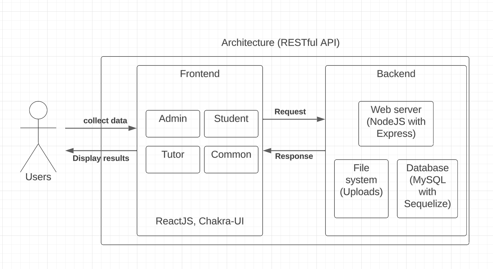

# Advanced-Programming-Project

## Goal:
Build a secure, maintainable, and user-friendly web application for EFREI Paris's internship management needs. 
Allow for efficient development and has the potential to incorporate advanced features in future iterations.

## Github link:
https://github.com/Senhua-Liu/Advanced-Programming-Project

## Contributors (EFREI Paris M2 SE1):

    Camille FOUR
    Huiting FENG
    Senhua LIU
    Van Alenn PHAM

# 1. Description:
## 1.1 Architecture(s)
### 1.1.1 General description
This is a web application designed to facilitate the management of internships, incorporating a range of functionalities from internship tracking to user management. It is structured to support various user roles, including students, tutors, and administrator, providing a tailored experience for each. We should also have a user with type of school teacher (tutor of school), but we don't have time to implement this kind of user and those functionalities belonging to this kind of user. All in all, this project employs a RESTful API architecture through its server design, defining how the client (React.js frontend) communicates with the server (Node.js backend) over HTTP to perform CRUD operations on database via Sequelize.
- Scalability: modular design (REACTJS) allows easy addition of new features or entities.
- Security: all passwords are hashing. We use userContext and localStorage to get the current logged in user's information and let them go to different interfaces of internship management system. In total, there are 3 user interfaces: student, tutor, admin. For those files of this system, we decided to let final report and CdC be in the normal level, and other files are all in sensitive level. From the project's requirements, all sensitives files can only be viewed, but all normal files can be viewed, printed, downloaded.

### 1.1.2 Features finished
Implement access control with three profiles: admin, tutor, and student.
- In the tutor space, we can:
Have access to internship reports and "Cahier des charges" for assigned interns.
Can validate and provide feedback on reports submitted by interns.
View and manage the list of interns assigned to them.
Add or remove interns from their assigned list.
Customize fields related to internships, such as progress tracking and evaluation criteria.
- In the student space, we can:
Submission of internship reports before specified deadlines.
Access to their own internship reports and feedback provided by tutors.
View internship guidelines and requirements.
Search and retrieve internship-related documents using a keyword-based search engine.
Receive notifications and reminders for upcoming deadlines and milestones.
- Finally, in the admin space (only one admin):
Access to all internship reports and documents submitted by students.

### 1.1.3 Architecture diagram of our solution
- use case:

- old version of class diagram:

- new version of class diagram:

- architecture: 

Our web application follows a typical model full-stack architecture with a separation of concerns. The backend handles API requests, database operations, and file storage, while the frontend manages user interactions, state management, and presentation. This structure supports scalability, maintainability, and ease of development, with each part of the application focused on specific responsibilities.
- frontend (reactjs):
    - Single Page Application (SPA): Utilizes ReactJS, a modern JavaScript library for building user interfaces, to create an SPA. This approach enhances user experience by making the application more responsive and interactive without the need for page reloads.
    - Components and Context: The application is organized into components (e.g., AdminChatC.tsx, TutorManageInternshipsC.tsx) that manage different parts of the UI. Context API is used for managing global state across components, facilitating data sharing and state management without prop drilling.
    - Static Assets and Pages: Assets and HTML templates are stored in the public directory, while the src/pages directory likely contains the JSX files for different pages within the application.
- backend (nodejs):
    - Express Framework: The server is built with Node.js, using the Express framework to handle HTTP requests and routing. This setup allows for efficient development of both API endpoints (e.g., internshipRoutes.js, userRoutes.js) and middleware for various functionalities.
    - Database Connection and ORM: Sequelize, an Object-Relational Mapping (ORM) library, is used for database interactions, abstracting complex SQL queries and enhancing code maintainability. Configuration files (config.js, sequelize.js) manage database connections and settings.
    - Data Models: Models (internship.js, user.js) define the structure of data within the application, mapping directly to database tables. This layer facilitates data retrieval, insertion, and other database operations.
    - Environment Configuration: Environment variables are managed through .env files, allowing for secure and flexible configuration of database credentials, API keys, and other sensitive information without hardcoding them into the source code.
    - Mock Data and Scripts: The mockData.js file and scripts (insertInternship.js, insertUser.js) are likely used for seeding the database with initial data for development and testing purposes.
- overall structure:
    - Client-server architecture: separate frontend (client) and backend (server). (separate frontend UI and backend logic).
    - RESTful API: backend exposes RESTful endpoints for data operations, and frontend consumes to display and manipulate data. Express is to define routes and handlers for various HTTP operations. Each route are the CRUD operations (create, read, update, delete) that interact with the MySQL database; Endpoints under the routes folder are the URLs we request to perform specific operations on the server's resources (internships, users). For instance, a GET request to /api/internship might retrieve all internships, while a POST request to /api/user/register could create a new user. As for data formats, all communication between the client and server is typically done using JSON (JavaScript Object Notation), which is easy to read and write and well-supported in JavaScript. As for Statelessness, each request from client to server must contain all the information the server needs to understand the request and cannot take advantage of any stored context on the server. Each request is treated as new. 
    - Modern full-stack javascript: use js both on front and back to enable a more unified development experience.
    - Scalability and maintainability: use modular components, services, and modern development practices.

## 1.2 Technical choices

    Frontend: React, Chakra UI, TypeScript
    Backend: Node.js, Express
    Database: MySQL(Sequelize)

## 1.2.1 Frontend: 
- React: A JavaScript library for building user interfaces. It's an excellent choice for building complex, interactive web applications. React's component-based architecture makes it easy to manage the state and lifecycle of various UI elements, which is ideal for project's requirement of a user-friendly and intuitive interface.
- Chakra UI: This is a simple, modular, and accessible component library that gives us the building blocks to build React applications. Chakra UI will speed up the development process and ensure that the application is accessible and visually appealing.
- TypeScript: A superset of JavaScript that adds static types. Using TypeScript is a wise choice for enhancing code quality, making it easier to maintain, understand, and catch errors early.

## 1.2.2 Backend:
Node.js & Express: Node.js is a JavaScript runtime built on Chrome's V8 JavaScript engine, and Express is a fast, unopinionated, minimalist web framework for Node.js. This combination is lightweight, efficient, and highly scalable, suitable for handling a large number of simultaneous connections which might be the case with numerous students accessing the system.

## 1.2.3 Database
MySQL with Sequelize: MySQL is a robust and widely-used relational database management system. Sequelize, an ORM for Node.js, will simplify database queries and allow easier manipulation of data. It supports strong data modeling and robust transaction support, which is vital for maintaining the integrity of students' reports and metadata.

## 1.2.4 Analysis
- Scalability & Performance: Node.js and MySQL are scalable solutions that can handle growth in data and user load. React's efficient DOM updates (via its virtual DOM) will keep the UI fast and responsive.
- Security: Managing sensitive internship reports requires a focus on security. The stack supports robust authentication and authorization mechanisms, and Sequelize helps prevent SQL injection attacks.
- Maintainability: The use of TypeScript, along with the modular nature of React and Node.js, aids in keeping the codebase maintainable and well-structured.
- User Experience: React combined with Chakra UI and Tailwind CSS will ensure an engaging and accessible user interface.
- Documentation and Setup: Node.js and React ecosystems are well-documented, which should assist in making the setup and deployment process clear and straightforward.
- Risk and Innovation: Incorporating advanced features like AI/ML for document analysis or advanced search could be a challenging yet innovative addition. Also, using modern architectural patterns like microservices (if deemed necessary) can enhance the project's architecture.

## 1.3 Technical presentation

Precisely for the frontend, we use ReactJS for building a dynamic and responsive UI and use Chakra-UI for design components. For the backend, we use NodeJS with Express.js framework for handling server side logic and API endpoints. creation. As for the database, we use sequelize with MySQL for data persistence, managing relationships between internship records, user details, and other related data. 

- modules: Components for UI (e.g., forms, lists, modals), services for API calls, contexts for state management, and utilities for common functions. Controllers for business logic, models for database schemas, routes for API endpoints, and utilities for common operations like password hashing. 

- key packages and files:
    - .env: environment variables for database credentials, and the url of backend so that the frontend can reach to the backend.
    - /frontend: Contains all client-side code, including subdirectories for components, contexts, pages, assets, and a authenticate.tsx file which is used to control all routers.
    - /backendNode: Hosts the server-side code, including models,controllers, routes and database configuration files.
    - /backendNode/models: Sequelize models defining the structure of database tables.
    - /backendNode/routes: Express.js routes to handle API requests.
    - /backendNode/scripts: 2 tables containing initial data to test this web application (need to insert into this web application at the very beginning).
    - /backendNode/config: 3 files under this folder are used to manage the database configuration and connection of the application. config.js reads the DB_URL environment variable, parses it using the "url" module to extract the database connection details, and exports configurations for the ORM. db_connection.js works the same as the config.js and it creates a MySQL connection using those details so that this connection can then be used throughout the application to interact with the database directly. sequelize.js initializes and exports a Suquelize instance for ORM-based database interactions. These 3 files ensure flexible, environment-specific database connectivity and interaction methods for the application.
    - /backendNode/mockData: serve the purpose of providing mock (simulated) data for the application. It is often used during development and testing phases. Developers can use mock data to generate large volumes of data to test the performance and scalability of the application. But for this application, we just have a small database including just 2 tables (user and internship).

## 1.4 Delivery Methodology
- Up to now, we don't do the delivery part for this project, but in the future we might do these steps below to move our codes from development through testing and into production in an automated and reliable manner.
    - CI/CD configurations: use GitHub Actions workflows to specify the automated tasks that run upon code commits. If we have unit test or integration tests, we should create test scripts within package.json to define commands to run those tests.
    - Environment management: since we used .env files, we need to separate settings for different environments (.env.development, .env.production). Also, some scripts are needed to add on the package.json to run commands for different environments (npm run start:dev or npm run build:prod).
    - Monitoring: if possible, we can use Grafana to monitor this web application. It allows use to create dashboards that provide real-time visibility into the performance and health of our system.

## 1.5 Integration of clean code principles
- Single Responsibility Principle (SRP): In React, components should be focused on rendering UI elements and handling user interactions. In Node.js, modules should be designed to perform specific tasks, such as handling HTTP requests, data validation, or database interactions. For example, the components starting with "Admin" on the components folder mean that those components are all for Admin. The same situations are for students and tutors. Each component does their own job.
- Open/Closed Principle (OCP): In React, components can be extended or composed to add new functionality without modifying existing code. In Node.js, modules can be designed to support extension through dependency injection or by using interfaces and implementations. For example, the datatype of meetingList on the internship table uses JSON, which can add many new fields to handle the "meetingList", the same as files on the internship table.
- Liskov Substitution Principle (LSP): In React, components should adhere to their defined contracts and behave consistently when substituted or extended. In Node.js, modules should implement consistent interfaces to ensure interoperability and compatibility.
- Interface Segregation Principle (ISP): In React, components should expose only the necessary props and methods required for their intended use. In Node.js, modules should provide well-defined interfaces tailored to their specific functionality, avoiding unnecessary dependencies.
- Dependency Inversion Principle (DIP): In React, components should rely on abstractions (props, context, hooks) rather than directly accessing lower-level implementation details. In Node.js, modules should use dependency injection or inversion of control containers to manage dependencies and promote decoupling.
- Naming: Our variable names are clear and indicative of their purpose, avoiding cryptic abbreviations or single-letter names. We also use meaningful and descriptive names for folders, variables, functions, classes, and other identifiers throughout the codebase. For example, for all components on the frontend folder, they all have a "C" letter at the end, which means that this file is a "component". 

## 1.6 Tour of features via a demo
- Link of all features: https://efrei365net-my.sharepoint.com/:f:/g/personal/huiting_feng_efrei_net/EgacvPC0DKRCmbGKlkTIXyIBA5zfuyHuMuKK7_qCzK83aQ?e=hhjhYz
- Link of demo with some features: https://youtu.be/zxrEg9C3g_k
- Creativity of our solution: use Sequelize (ORM) to handle database (developer friendly); simple to use the system for all users; the whole system design is simple and understandable
- the most difficult part to implement: the devops part and the other functionalities non-finished
- Reason: Without enough time to implement and still new to use well those tools/languages
- If this type of project done by other totally different group of students: they might more focus on backend and devops, and they might choose Java sprint boot to code this project, since the tendance of industry is using this language.
- the three most important things got from this project: choose technical stacks as soon as possible and everyone should know well those chosen languages, design well the architecture at first if possible, do the backend along with the frontend and should not wait until the frontend is finished, because the frontend part is changing all the time.

## 1.6 Future enhancements to implement later

### 1.6.1 Must do:
- Provide notifications from admin to students and tutors, about the deadline of files/meetings, and about the some public or private messages that admin wants to talk to the students and tutors.
- Implement the chat part so that admin can talk to students and tutors
- Implement the keyword keyword search for each internship and each file, so that all users (admin, student, tutor) can easily search those internships or files on their account
- Prevent users (students/tutors) upload files or fill forms after pass the deadlines predefined by the admin
- Add another user role called teacher so that the tutor of school can validate the student's files too, and the fiche visit should be filled also by this role (teacher/tutor of school) 
- Add responsive design for all
- For those questions of different forms and files, all should be stocked on the backend database, rather than hardcoding on the frontend side. Another model called question and another router called questionRoutes.js should be created. Each time, the questionnaire of the forms should be fetched directly from the backend database. Also, the admin should be able to add/modify questions of all forms.
- Those components on the frontend should be divided into smaller one (atoms, molecules, organisms, templates, pages).

### 1.6.2 Can do:
- Real-time notifications: using WebSockets for real-time updates to tutors and students.
- Analytics Dashboard: For insights into internship trends and student performance.
- Mobile Responsiveness: Ensuring the application is fully responsive and accessible on mobile devices.
- Integrate the real-time collaboration tools for the meeting part.
- Add more security features on the login part such as Oauth 2.0 login to connect to myEfrei. 

# 2. Used tools:
- Visual studio code
- Git
- Postman
- MySQL (MySQL Workbench)
- Node
- Figma
- StarUML
- Lucidchart

# 3. Manual (steps to run application on your computer):
- git clone this project on the computer
- enter into this folder/project and open it with Visual Studio Code
- create a database called internship_system on the computer using MySQL Workbench
- start/run the MySQL server on the computer
- go to the root of frontend folder, and add a new file called .env
- paste this line into the .env file (don't leave a space): REACT_APP_BACKENDNODE_URL=http://localhost:3001
- go to the root of backendNode folder, and add a new file called .env
- paste this line into the .env file and change key information according to your local database's credential information: DB_URL=mysql://root:@localhost:3306/internship_system
- stay on the root of backendNode folder, tape command to initialize database's user table: node ./scripts/insertUser.js
- stay on the root of backendNode folder, tape another command to initialize database's internship table: node ./scripts/insertInternship.js
- stay on the root of backendNode folder, and tape command to install necessary package: npm i
- stay on the root of backendNode folder, and tape command to run backend server: npm run dev
- create a new terminal on the code editor (need to at least 2 terminal opened)
- return and go to the root of frontend folder, and tape command to install necessary package: npm i
- stay on the root of frontend folder, and tape command to run the frontend server: npm start
- wait the new automatically opened browser or open a new browser and then input this url to use the application : http://localhost:3000

# 4. Steps of development:
- study the subject and list functionalities and make order by their importance & difficulties
- finish the figma design
- finish the UML (but abandoned later)
- finish the frontend (general design)
- finish the backendNode and develop by checking on the frontend part
- check generally the whole web application
- remove unused or unimplemented part from codes
- write documentation and do other part except the coding part

## 4.0 BackEnd Node (used technology)

## 4.1 Backend Flask (abandoned technology)
### 4.1.1 activate virtual environment
    cd backend
    python3 -m venv venv
    source venv/bin/activate 
    or venv\Scripts\activate (for windows)

### 4.1.2 install dependencies
    pip install -r backend/requirements.txt

### 4.1.3 run app
    python3 backend/main.py
    or 
    python main.py

## 4.2 Frontend (used technology)

## 4.3 MySQL Database (credentails)
An old version of MySQL database (cf. the uploaded UML document) was abandoned, because we found that it was difficult to handle so many associations (foreign keys) on the real development of web application. Right now, the new database only contains 2 tables (user and internship). Internship has 2 foreign keys (studentID and tutorID). Here below are the structure of database, and the database's details can be checked from the backendNode folder. The preset database is in the ./backendNode/data/mockData.js file.

    interface User {
        id: number;
        firstName: string;
        lastName: string;
        email: string;
        password: string;
        type: string;
        telephone: string;
        oldPassword: string;
        promotion: number;
        year: string;
        company: {
            name: string;
            address: string;
            city: string;
            zipCode: string;
        };
    };

    interface Internship {
        id: number;
        duration: number;
        type: string;
        jobTitle: string;
        mission: string;
        salary: number;
        startDate: Date | string;
        endDate: Date | string;
        studentID: number;
        tutorID: number;
        meetingList: {
            type: string;
            date: string;
            location: string;
            finished: boolean;
            deadline: "";
        }[];
        files: [
            {category: 1, type: "final report", content: [], confidential: 1, finished: false, deadline: "", message: ""}, 
            {category: 2, type: "CdC", content: [], confidential: 1, finished: false, deadline: "", message: ""},
            {category: 3, type: "fiche visit", content: [], confidential: 0, finished: false, deadline: "", message: ""},
            {category: 4, type: "first self-evaluation form", content: [], confidential: 0, finished: false, deadline: "", message: ""},
            {category: 5, type: "second self-evaluation form", content: [], confidential: 0, finished: false, deadline: "", message: ""},
            {category: 6, type: "third self-evaluation form", content: [], confidential: 0, finished: false, deadline: "", message: ""},
            {category: 7, type: "intermediate evaluation form", content: [], confidential: 0, finished: false, deadline: "", message: ""},
            {category: 8, type: "final evaluation form", content: [], confidential: 0, finished: false, deadline: "", message: ""},
        ];
        status: string;
        student: User;
        tutor: User;
    };

Here are the predefined database users' information, which are useful to login the web application without need to register a new user(student):

    email, password
    admin@efrei.fr, admin
    student1@efrei.net, student1
    student2@efrei.net, student2
    student3@efrei.net, student3
    student4@efrei.net, student4
    student5@efrei.net, student5
    student6@efrei.net, student6
    student7@efrei.net, student7
 
For your information, this web application use .com for all tutor's email, .fr for admin's email, .net for student's email. Also, all users passwords are irreversible (package of bcryptjs).

# 5. References: 
## 5.1. Figma 
https://www.figma.com/file/dL9itDvLdbiaw4j4IbSLdV/Bridge_Project_-_Form-(Copy)?type=design&node-id=0%3A1&mode=design&t=BifjF3Fi9aKz1euO-1  

## 5.2. UML (abandoned version)
cf. internship_system.mdj

## 5.3. Diagrams (Lucidchart)
https://lucid.app/lucidchart/594d45fb-954f-48a7-b8dd-0d575a64e906/edit?viewport_loc=-965%2C-727%2C1596%2C1501%2C0_0&invitationId=inv_d6132f93-9482-4ef6-8e42-53ad426087b3 
https://lucid.app/lucidchart/594d45fb-954f-48a7-b8dd-0d575a64e906/edit?viewport_loc=-340%2C607%2C1587%2C1501%2C0_0&invitationId=inv_d6132f93-9482-4ef6-8e42-53ad426087b3 

## 5.4. Video demo (Youtube)
https://youtu.be/zxrEg9C3g_k 
